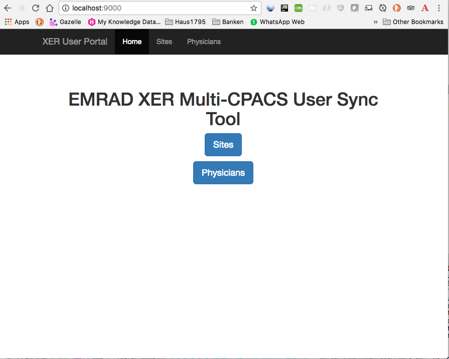

= XER CPACS Sync Tool User Portal

== XER CPACS Sync Tool User Portal

:author: Karsten Spakowski
:email: karsten.spakowski@ge.com
:revnumber: v0.1
:revdate: 12.07.2017
:revremark: First draft


Description of a XER Sync Tool User Portal for *Centricity PACS*


=== Introduction

If a Radiologist is responsible to report studies  on several CPACS he needs to have a UV/CPACS account on each Trust.
To be able to connect to a remote site with the local UV viewer application, the user must exist on both sites/Trusts and the username and password must be the same.
This tool offers the possibility to keep CPACS user password in sync, so a user can work on several sites with no need to sync the password.


== Configure a Trust on the Portal




[NOTE]
Select the Sites button from the home page


[NOTE]

Select a site to edit or press the add button to create a new site


[NOTE]

Enter site specific data


*Site specific data*

* *ID*  _that value is created by the database_
* *Name* _short string which indentify a site needs to be unique on the installation_
* *City* _enter a human readable information to identify the site_
* *XER User Group* _enter a existing group which must be member SERVICE ROLES, For EMRAD, the group Remote_Radiologists MUST be used for ALL Trusts._
* *Web Service Port* _port of the restful web service which decrypt the password for comparison_
* *IMS IP Address* _IP address of the IMS Databse used to connect to the SOAP Service PacsSecuritySvc_


[IMPORTANT]

You find the valid XER user group either in the CAT tool or with the sql statement: +
``select resource_value from configuration where resource_index = 7105
``


== Enter a new Physician


To add a new physician enter the data in to the XER User Portal


Select the add button


Enter the physician information, make sure the user exist on the select home trust


save the data


At that point the existence of the user at the selected Home trust is checked, if the user does not exist it won't be created on the XER Portal
Otherwise the user is now part of the portal but since the physician is not mapped to any other site no synchronisation is going on


Map the user to a Remote Trust, select the map button


select the add button and select the Remote trust from the dropdown list


The user is now created on the Remote trust.
The user won't be created if it exists already and the portal will show an error message.
The user password is not synchronised yet, this will happen during the next job.


== Installation CpacsUserService

[IMPORTANT]

One Restful Webservice need to be installed for each site which is connected to the XER User Portal


The Restful Webservice is developed because the CPACS Soap Security Service has no method which allows to check the password or to activate/deactivate a user

* create for each site which is supposed to collaborate with the  XER user portal a sub dir and name the directory after the site
* put the cpacsservice.jar in that directory and rename it to cpacsusers<site>.jar
* create a application.properties file


=== setup a service application.properties


[source, properties, numbered]
----
server.port: 9100 # <1>
management.port: 9101 <2>
#management.address: 127.0.0.1


spring.datasource.driverClassName=net.sourceforge.jtds.jdbc.Driver
spring.datasource.url = jdbc:jtds:sybase://10.40.24.102:20000/ims  #<3>
spring.datasource.username = sa
spring.datasource.password = db-password <4>
spring.jpa.properties.hibernate.dialect = org.hibernate.dialect.SybaseDialect


config.property.decrypt.key=s3cr3t

# choose your logging level TRACE, DEBUG, INFO, WARN, ERROR, FATAL, OFF
#logging.level.com.ge.hc.dicom = TRACE
logging.level.com.ge.hc.cpacs = DEBUG  # <5>
#logging.level.com.ge.hc.dicom = INFO
#logging.level.com.ge.hc.dicom = WARN
#logging.level.com.ge.hc.dicom = ERROR
#logging.level.com.ge.hc.dicom = FATAL
#logging.level.com.ge.hc.dicom = OFF

logging.file=log/site.log # <6>
----


application.properties


[NOTE]

server.port and management.port (<1>,<2>) must be unique,
adjust the db connection (<3>,<4>) to the specific site
and setup the logging parameter (<5>,<6>)


== configure cpacsuserservice to run as a service


create a file  /etc/systemd/system/cpacsusersnhu.service

```
# Automatically generated by systemd-sysv-generator

[Unit]
Documentation=man:systemd-sysv-generator(8)
SourcePath=/etc/init.d/cpacsusersnhu
Description=LSB: cpacsusers nhu
After=remote-fs.target
After=systemd-journald-dev-log.socket
After=network-online.target
Wants=network-online.target

[Service]
Type=forking
Restart=no
TimeoutSec=5min
IgnoreSIGPIPE=no
KillMode=process
GuessMainPID=no
RemainAfterExit=yes
ExecStart=/etc/init.d/cpacsusersnhu start
ExecStop=/etc/init.d/cpacsusersnhu stop
```

create a symbolic link in etc.init.d

[source, properties]
sudo ln -s /home/geadmin/cpacs/ulh/cpacsusers<site>.jar /etc/init.d/cpacsusers<site>

control the service

```
$ sudo /etc/init.d/cpacsusers<stite>
Usage: /etc/init.d/cpacsusers<site> {start|stop|force-stop|restart|force-reload|status|run}
```

Test the service
```
curl http://localhost:9100/hello-cpacs?name=WEB
{"id":4,"userName":"WEB","password":"]I) 8T","active":1,"firstName":"WEB","middleName":null,"lastName":"ADMINISTRATOR","decryptPassword":"QWKLZX"}
```

== Setup the XER Portal service


=== setup a service application.properties


[source, properties, numbered]
----
server.port=9000
#server.contextPath=/xer

spring.datasource.url = jdbc:mysql://localhost:3306/xer
spring.datasource.username = root
spring.datasource.password = engineer

#spring.jpa.hibernate.ddl-auto=create-drop
spring.jpa.hibernate.ddl-auto=update
//spring.jpa.show-sql = true
xer.password.sync.pollTime=30000  # <1>
logging.level.org.springframework = INFO
logging.level.com.ge.hc.emrad = TRACE
logging.level.org.springframework.ws = TRACE
logging.level.org.springframework.oxm.jaxb = TRACE
# choose your logging level TRACE, DEBUG, INFO, WARN, ERROR, FATAL, OFF
logging.level.com.ge.hc.emrad = DEBUG

logging.file=log/xer.log
----

[IMPORTANT]

<1> the time between two synchronisation process in msec, currently 1 min in production environment.


== configure cpacsuserservice to run as a service


create a file /etc/systemd/system/xer.service

```
# Automatically generated by systemd-sysv-generator

[Unit]
Documentation=man:systemd-sysv-generator(8)
SourcePath=/etc/init.d/xer
Description=LSB: XER Portal
After=remote-fs.target
After=systemd-journald-dev-log.socket
After=network-online.target
Wants=network-online.target

[Service]
Type=forking
Restart=no
TimeoutSec=5min
IgnoreSIGPIPE=no
KillMode=process
GuessMainPID=no
RemainAfterExit=yes
ExecStart=/etc/init.d/xer start
ExecStop=/etc/init.d/xer stop
```

create a symbolic link in etc.init.d

```
sudo ln -s /home/geadmin/cpacs/xer/xer-0.0.4.jar /etc/init.d/xer
```


```
$ sudo /etc/init.d/xer
Usage: /etc/init.d/xer {start|stop|force-stop|restart|force-reload|status|run}
```


To connect to the Sync Tool, use  the Service Portal

Site: EMRAD Park Royal Data Centre


User credentials:

* user geadmin
* password engineer


